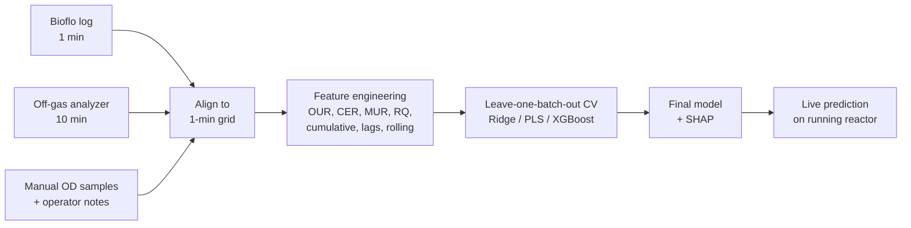

# Bioreactor Biomass Soft Sensor

An ML pipeline that predicts real-time biomass (optical density, OD) in a methanotroph
bioreactor from off-gas and process signals. The model replaces infrequent manual OD
sampling with a continuous estimate that can drive harvest decisions.

- **Feature engineering:** gas uptake/evolution rates (OUR, CER, MUR), respiratory
  quotient (RQ), stoichiometric ratios, cumulative mass-balance integrals, lags,
  deltas and rolling statistics
- **Model benchmarking:** XGBoost, Ridge, and PLS regression with leave-one-batch-out
  cross-validation
- **Interpretability:** SHAP feature importance on the final model
- **Live prediction:** a watcher that re-predicts OD each time the run's data file is
  updated during a live reactor run

> The reactor data behind this project is proprietary, so it is not included and no
> results are reported here. The repository shows the pipeline and methodology; see
> [`data/README.md`](data/README.md) for the input format needed to run it.

## Background

Methanotrophic bacteria are grown in an Eppendorf BioFlo 120 in repeated-batch mode:
the culture grows to a target density, most of it is harvested, and the reactor is
refilled with fresh media to start the next batch. OD is measured by hand only a few
times per day, but the reactor controller and off-gas analyzer log continuously.
Because cells consume CH4 and O2 and produce CO2 in proportion to their growth, the
off-gas signals carry enough information to infer biomass between manual samples.

This is a sparse-label tabular regression problem: each manual OD sample becomes one
training row, with features computed from the dense sensor stream leading up to it.

## Pipeline



### 1. Time alignment

The Bioflo controller log (~1 min), off-gas analyzer (~10 min) and manual OD log are
clipped to their common time range, interpolated onto a shared 1-minute grid, and
joined so every manual OD sample lines up with a sensor row. Batch numbers from the
manual log are filled across the sensor rows so that per-batch features reset at each
harvest/refill.

### 2. Feature engineering

Gas uptake and evolution rates come from a gas mass balance across the reactor:

```
F_out = F_in · (100 − O2_in − CH4_in) / (100 − O2_out − CH4_out − CO2_out)   # N2 balance
OUR   = (F_in · O2_in  − F_out · O2_out)  · k
MUR   = (F_in · CH4_in − F_out · CH4_out) · k
CER   =  F_out · CO2_out                  · k
k     = 60 · 1000 / (100 · 22.414 L/mol · V_reactor)       # (L/min)·% → mmol/L/h
```

Outlet flow is estimated from an inert-gas (N2) balance, since consumption of CH4 and
O2 shrinks the gas volume passing through the reactor. Ratios are left missing when
their denominator is below 1 mmol/L/h, where analyzer noise would dominate.

| Group            | Features                                                                 |
| ---------------- | ------------------------------------------------------------------------ |
| Physiological    | OUR (O2 uptake), MUR (CH4 uptake), CER (CO2 evolution) in mmol/L/h; RQ = CER/OUR, O2:CH4 = OUR/MUR, carbon recovery = CER/MUR |
| Cumulative       | Integrated OUR, MUR and CER since batch start in mmol/L, time since batch start |
| Trajectory       | Lagged values and deltas at 15, 45, 60, 90, 120 min                      |
| Rolling          | Rolling mean and std over 15, 30, 60 min                                 |
| Process state    | DO, pH, temperature, agitation, gas flow                                 |
| Batch context    | Fraction of batch elapsed                                                |

The cumulative features are the stoichiometric backbone: total methane consumed since
the batch started is the carbon available for growth. The ratios describe the
culture's metabolic state: O2:CH4 and carbon recovery indicate how much consumed
methane carbon goes to biomass versus CO2.

Gas signals are smoothed with a trailing 5-minute rolling mean. It uses no future data,
so the same features can be computed identically during a live run.

### 3. Model benchmarking

Three model families are compared on the same features:

- **Ridge regression:** a regularized linear baseline, with the penalty chosen by
  built-in cross-validation
- **PLS regression:** handles the heavily correlated feature set (lags and rolling
  windows of the same signals) by projecting onto a few latent components
- **XGBoost:** captures nonlinear effects. It is trained on log(OD) to match the
  roughly exponential growth, with hyperparameters tuned by an inner grid search

Ridge and PLS use median imputation and standard scaling. XGBoost handles missing
values natively.

Evaluation uses **leave-one-batch-out cross-validation**: each fold holds out one full
batch, so the model is always tested on a growth curve it has never seen. This
prevents leakage between neighboring samples of the same batch, which a random split
would allow. The main metric is mean absolute error in OD units, along with R² and
out-of-fold predicted-vs-actual plots for each run.

### 4. Interpretation

The final XGBoost model is explained with SHAP (TreeExplainer), which shows how much
each feature pushes a prediction up or down. This checks that the model relies on
physically meaningful signals, such as cumulative gas uptake and dissolved oxygen,
rather than artifacts.

### 5. Live prediction

The saved model bundle holds the estimator, its feature order and any preprocessing.
During a run, `predict_live.py` watches the run's workbook. Each time new sensor data
is written, it rebuilds features with the same pipeline used in training and
predicts OD at the latest timestamp.

## Usage

```bash
pip install -r requirements.txt
```

Place one workbook per run in `data/formatted/` using the format described in
[`data/README.md`](data/README.md).

### Train and benchmark

```bash
# Benchmark all three models and save the XGBoost model + SHAP plot
python train.py -w data/formatted/*_DATA.xlsx --save-model xgboost

# Benchmark a subset, also exporting the feature table and per-batch feature plots
python train.py -w data/formatted/*_DATA.xlsx -m ridge xgboost --save-features --plot-features
```

| Option             | Default                      | Description                                  |
| ------------------ | ---------------------------- | -------------------------------------------- |
| `-w, --workbooks`  | required                     | Run workbooks to train on                    |
| `--reactor-volume` | `5.0`                        | Broth volume (L) for mmol/L/h rates          |
| `-m, --models`     | `ridge pls xgboost`          | Models to cross-validate                     |
| `--save-model`     | none                         | Fit this model on all data and save it       |
| `--bundle-path`    | `models/model_bundle.joblib` | Where to save the model                      |
| `-o, --output-dir` | `outputs`                    | CV results, plots, SHAP                      |
| `--save-features`  | off                          | Write the full feature table to CSV          |
| `--plot-features`  | off                          | Plot features vs OD for every batch          |

Outputs written to `--output-dir`:

- `cv_summary.csv`: one row per model with pooled MAE/R² and mean ± std fold MAE
- `cv_folds_<model>.csv`: per-batch fold metrics
- `cv_plots/`: out-of-fold predicted vs actual OD over time, per run and model
- `shap_plots/shap_summary.png`: SHAP summary (with `--save-model xgboost`)
- `feature_plots/`: engineered rates per batch with manual OD overlaid (with `--plot-features`)

### Live prediction

```bash
python predict_live.py -w data/formatted/<RUN_ID>_DATA.xlsx --interval 600
```

Each prediction is printed and appended to `outputs/live_predictions.csv`
(`--log-path`):

```
[<predicted at>] <RUN_ID> batch <n> @ <latest sensor timestamp>: predicted OD = <value>
```

Use `--once` to predict a single time and exit. `--reactor-volume` must match the value
used in training.

## Project structure

```
├── bioreactor_od/
│   ├── data.py          # Workbook loading and time alignment
│   ├── features.py      # Feature engineering pipeline
│   ├── models.py        # Model fitting, CV, prediction
│   └── plots.py         # Diagnostic and SHAP plots
├── train.py             # Benchmark models, save final model
├── predict_live.py      # Live OD prediction during a run
└── data/README.md       # Expected input format (data not included)
```

## Limitations and next steps

- **Batch phase feature:** `batch_phase` is computed from the full batch duration,
  which is only known in hindsight. During a live run it is always 1.0 at the latest
  row, so it should be replaced with a feature available in real time (e.g. elapsed time
  normalized by a typical batch length).
- **Validation depth:** leave-one-run-out validation becomes the stronger test once
  more runs are collected.
- **Planned:** a mechanistic mass-balance baseline (cumulative CH4 × biomass yield)
  with ML correcting the residual, quantile regression for prediction intervals, event
  features from operator notes (antifoam, gas changes), and ONNX export for deployment.
